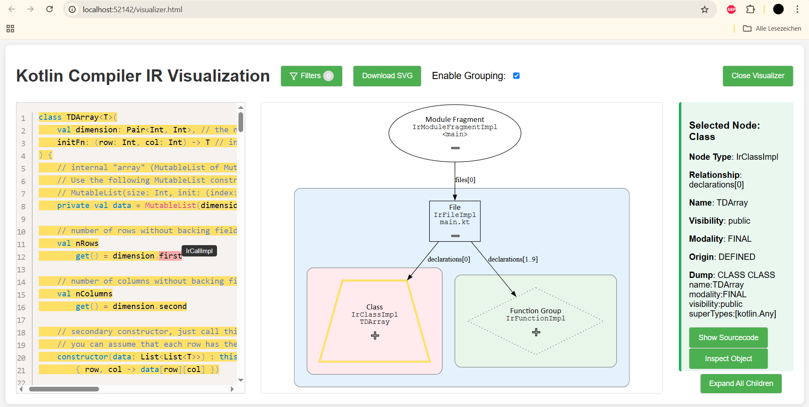

# Kotlin Compiler IR Visualizer

> Interactive graph‑based explorer for the Kotlin Intermediate Representation (IR).
> Built as a **Kotlin compiler plugin** that emits a **web UI** that renders an animated DOT graph with sourcecode‑ and property‑inspectors.



---

## Features

| Capability                | What it does                                                                                            |
|---------------------------|---------------------------------------------------------------------------------------------------------|
| **JSON export visitor**   | Traverses every IR node during compilation and serialises a concise JSON tree.                          |
| **Graph visualization**   | Converts JSON → DOT → SVG via **D3‑Graphviz**; clusters modules, files, classes and bodies for clarity. |
| **Interactive filtering** | Hide/show node kinds, collapse/expand branches, highlight search results.                               |
| **Edge labels**           | Relationship names as edge labels.                                                                      |
| **Source‑code inspector** | Bidirectional linking – clicking a node highlights the corresponding source range and vice versa.       |
| **Object inspector**      | Live query of all Kotlin properties of the selected IR node through reflection and a Ktor endpoint.     |

---

---

## Quick Start

### Clone & Build

```bash
# Clone repository
$ git clone --branch IRViz https://github.com/NeonMika/k-perf.git
$ cd k-perf
$ cd plugin

# Produce the compiler‑plugin JAR (use shadowJar for uber JAR)
$ gradlew shadowJar
$ cd build
$ cd libs
```

### Instrument your project

Pass the plugin to the kotlin compiler and enable the plugin

```bash
kotlinc test.kt -Xplugin="k-ir-visualizer-0.0.1-all.jar" -P "plugin:k-ir-visualizer-compiler-plugin:enabled=true"
```

The compiler plug‑in automatically opens the browser pointed to the visualizer and blocks until the visualizer is closed (via the corresponding button).

---

## Usage Tips

* Double‑Click a node to **expand ancestors**.
* Use the **Filter panel** to search for node-types or node-names.
* Hover over code in the code-inspector to see the types of the corresponding nodes.
* Click on the properties in the property-inspector to again get the properties of the result-object.
* Always click on "Close Visualizer" after usage to make the plugin run to completion.

